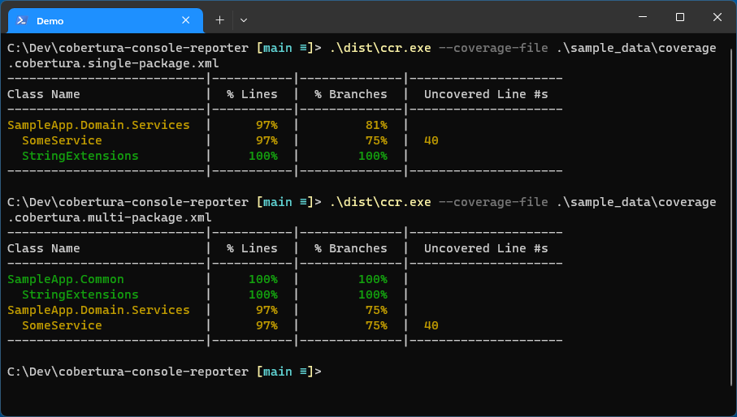

# Cobertura Console Reporter

Cobertura Console Reporter produces an easy to read console output for 
[Coverlet](https://github.com/coverlet-coverage/coverlet) output files (`coverage.cobertura.xml`) when
generated through the `dotnet` cli using the `--collect:"XPlat Code Coverage"` arg.

## Sample Output



## Downloads

Download the latest binaries for your platform here:

https://github.com/agartee/cobertura-console-reporter/releases/latest

## Usage

As Python module:

```bash
python -m cobertura_console_reporter --coverage-file <path_to_coverage_cobertura_xml_file> [--package <package_name>] [--warning-threshold <number>]
```

As Windows binary:

```powershell
ccr.exe --coverage-file <path_to_coverage_cobertura_xml_file> [--package <package_name>] [--warning-threshold <number>]
```

As Mac/Linux binary:

```bash
ccr --coverage-file <path_to_coverage_cobertura_xml_file> [--package <package_name>] [--warning-threshold <number>]
```

### Args

| Arg                 | Description                                                              |
|---------------------|--------------------------------------------------------------------------|
| --coverage-file     | Path to the `coverage.cobertura.xml` file produced by Coverlet.          |
| --package           | [Optional] Name of the .NET package (project) to display output for.     |
| --warning-threshold | [Optional] Coverage percentage to display as a warning (defaults to 90). |

## Sample Project Integration

### Sample Tool Download Snippet

Below is a sample snippet can be added to a `.ps1` PowerShell script to download the tool and extract `ccr.exe` to the `.bin/` folder in your project's directory.

```powershell
$rootDir = (get-item $PSScriptRoot).Parent.FullName

# **************************************************************************************
# Check Test Coverage Reporter Tool
# **************************************************************************************
$binDir = "$rootDir\.bin"

if ((Test-Path $binDir\ccr.exe)) {
  Write-Host "Test coverage reporter tool found. Skipping download." -ForegroundColor Green
}
else {
  $toolSrc = "https://github.com/agartee/cobertura-console-reporter/releases/download/latest/ccr_windows_amd64.zip"
  $toolDest = "$binDir\ccr.zip"

  If (!(test-path -PathType container $binDir)) {
    New-Item -ItemType Directory -Path $binDir | Out-Null
  }

  (New-Object System.Net.WebClient).DownloadFile($toolSrc, $toolDest)
  Expand-Archive $toolDest -DestinationPath $binDir
  Remove-Item $toolDest

  Write-Host "Test coverage console tool downloaded to $binDir."  -ForegroundColor Green
}
```

### Sample Tool Execution Script

The below script can be used to run your tests. This script assumes that all of your .NET test projects are contained in a `test/` directory, and they all have a package dependency of `coverlet.collector`. It will loop through all test projects in that directory, execute tests, generate coverage reports (to `.test-coverage/`) and execute the coverage report tool. You may need to modify this sample to fit your needs.

**test.ps1**:

```powershell
Param(
  [Parameter(Mandatory = $false, HelpMessage = "Configuration name (e.g. Release, Debug)")]
  [string]$configuration = "Debug"
)
$status = 0
$rootDir = (get-item $PSScriptRoot).Parent.FullName
$binDir = "$rootDir\.bin"

# Find test projects
$testProjects = Get-ChildItem -Path $rootDir\test -Filter *.csproj -Recurse -File | ForEach-Object { $_ }

# Remove old Coverlet coverage reports
$coverageDir = "$rootDir\.test-coverage"
if (Test-Path $coverageDir) {
  Remove-Item $coverageDir -Recurse -Force
}

# Define Coverlet exclusions dictionary (keyed by project name)
$exclusions = @{
  "SampleApp.Domain"                = @(
    "SampleApp.Domain.Models.*")

  "SampleApp.Persistence.SqlServer" = @(
    "SampleApp.Persistence.SqlServer.Migrations.*"
    "SampleApp.Persistence.SqlServer.Models.*")

  "SampleApp.WebAPI"                = @(
    "Program",
    "SampleApp.WebAPI.Configuration.*",
    "SampleApp.WebAPI.Formatters.*"
  )
}

foreach ($testProject in $testProjects) {
  # Determine project name, used for console output as well as coverage reporter's package filter setting
  $projectName = ($testProject.Basename -replace ".Tests", "")

  # Get exclusion list specific to the current test run
  if ($exclusions.ContainsKey($projectName)) {
    $exclude = ($exclusions[$projectName] | ForEach-Object { "[$projectName]" + $_ }) -join ","
  }

  Write-Host "Executing tests for $($testProject.Name)..." -ForegroundColor Blue

  # execute tests, collecting results using Coverlet
  dotnet test $testProject.FullName --no-build -c $configuration `
    --results-directory $coverageDir `
    --collect:"XPlat Code Coverage" `
    -- DataCollectionRunSettings.DataCollectors.DataCollector.Configuration.Exclude="$exclude"

  if ($status -eq 0) {
    $status = $LASTEXITCODE
  }

  # Find Coverlet coverage report that coincides with current test run
  $coverageFile = Get-ChildItem -Path $coverageDir -Filter "coverage.cobertura.xml" `
    -Recurse -File | Sort-Object -Property LastWriteTime -Descending | Select-Object -First 1

  # Execute the coverage reporting tool for test coverage console output
  & $binDir\ccr.exe --coverage-file $coverageFile.FullName --package $projectName

  # Write the exclusions used for the test coverage console output
  if ($exclude) {
    Write-Host "Coverage Exclusions:" -ForegroundColor Blue
    $exclusions[$projectName] | ForEach-Object { Write-Host "  $_" -ForegroundColor Blue }
    Write-Host
  }
}

exit $status

```

## Contributing

### Available PowerShell/Bash Scripts

These scripts are aimed to normalize script patterns across projects and platforms (based on [Scripts to Rule Them All](https://github.com/github/scripts-to-rule-them-all)). 

| Script                          | Description                                                                                                                                                                       |
|---------------------------------|-----------------------------------------------------------------------------------------------------------------------------------------------------------------------------------|
| `./scripts/setup.{ps1, sh}`     | Deletes the existing `Python` virtual environment if it exists and runs `bootstrap`.                                                                                              |
| `./scripts/bootstrap.{ps1, sh}` | Checks if `Python` is installed at the minimum version.<br>Creates and activates a `Python` virtual environment.<br>Installs `Python` dependencies from the `requirements` files. |
| `./scripts/test.{ps1, sh}`      | Executes unit tests.                                                                                                                                                              |
| `./scripts/build.{ps1, sh}`     | Builds the application as a single executable under the `/dist` directory using PyInstaller.                                                                                      |

### Troubleshooting

When running the `build.sh` script on Linux using `pyenv` to manage Python versions, you 
may need to install Python enabling shared libraries:

```bash
env PYTHON_CONFIGURE_OPTS="--enable-shared" pyenv install 3.9.9
```

You may also need to install the following packages in addition to Python in a Linux environment:
- python-is-python3
- python3-venv